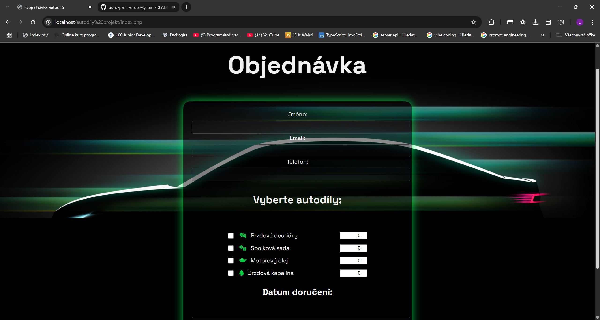
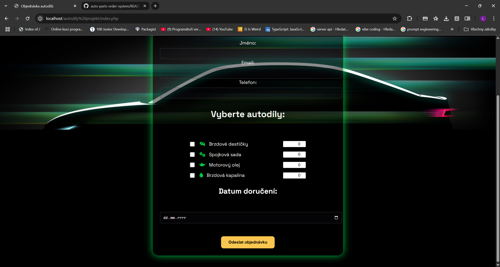
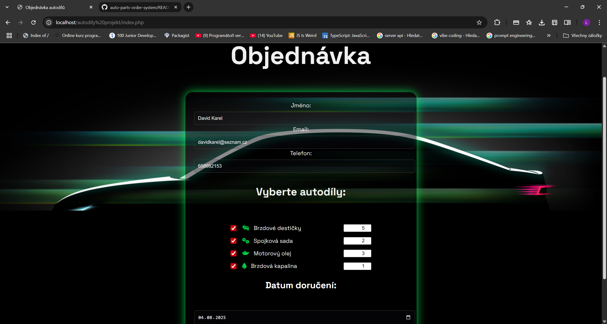
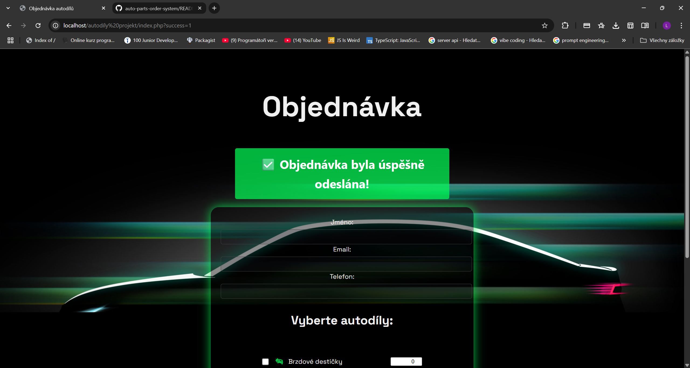

# Auto Parts Order System / Objednávkový systém autodílů

📦 A simple PHP-based web app for creating and managing auto part orders.  
💡 Jednoduchá PHP aplikace pro zadávání a správu objednávek autodílů – součást mého vývojářského portfolia.

---

## 🖼️ UI Preview / Náhled aplikace krok za krokem

---

### 🟢 1. Výběr autodílů a datum doručení

Díly se zadávají včetně množství, každý řádek má svou vlastní ikonku a textové pole.

---

### 🟢 2. Vyplněný formulář

Uživatel vyplnil všechna data včetně kontaktních údajů a zvolil díly i datum.

---

### 🟢 3. Odeslání objednávky

Po zadání všech údajů klikne uživatel na žluté tlačítko pro odeslání objednávky.

---

### 🟢 4. Potvrzení úspěchu

Zobrazí se zelené potvrzení, že objednávka byla úspěšně odeslána a uložena do databáze.

---

## 🎥 Video Demo (Download)

📺 [⬇️ Download demo video – auto-parts-demo.mp4](auto-parts-demo.mp4)  
> GitHub nepodporuje přímé přehrávání videí větších než ~10 MB. Kliknutím se soubor stáhne.

---

## 🔧 Technologies Used / Použité technologie

- ✅ PHP (procedural)
- ✅ MySQL
- ✅ HTML5 + CSS3
- ✅ JavaScript
- ✅ DaVinci Resolve (video rendering)

---

## 🧩 Features / Funkce

- Přehledné zadávání objednávek autodílů
- Klientská i serverová validace
- Ukládání dat do databáze MySQL
- Video prezentace a UI se zaměřením na použitelnost

---

## 📂 Project Structure / Struktura projektu

📁 / (root)
├── index.php # Homepage & order form
├── objednavka.php # Handles form data
├── submit_order.php # Inserts to DB
├── admin.php # Admin interface
├── config/ # DB config
├── db/ # SQL structure
├── img/ # Screenshots used in README
├── style/ # CSS styles
├── auto-parts-demo.mp4 # Video demo
└── README.md

---

## 👤 Contact / Kontakt

- GitHub: [https://github.com/Lukas33K](https://github.com/Lukas33K)

---

⭐ Projekt vytvořen jako součást mého PHP portfolia.  
⭐ Project created as part of my PHP portfolio.
